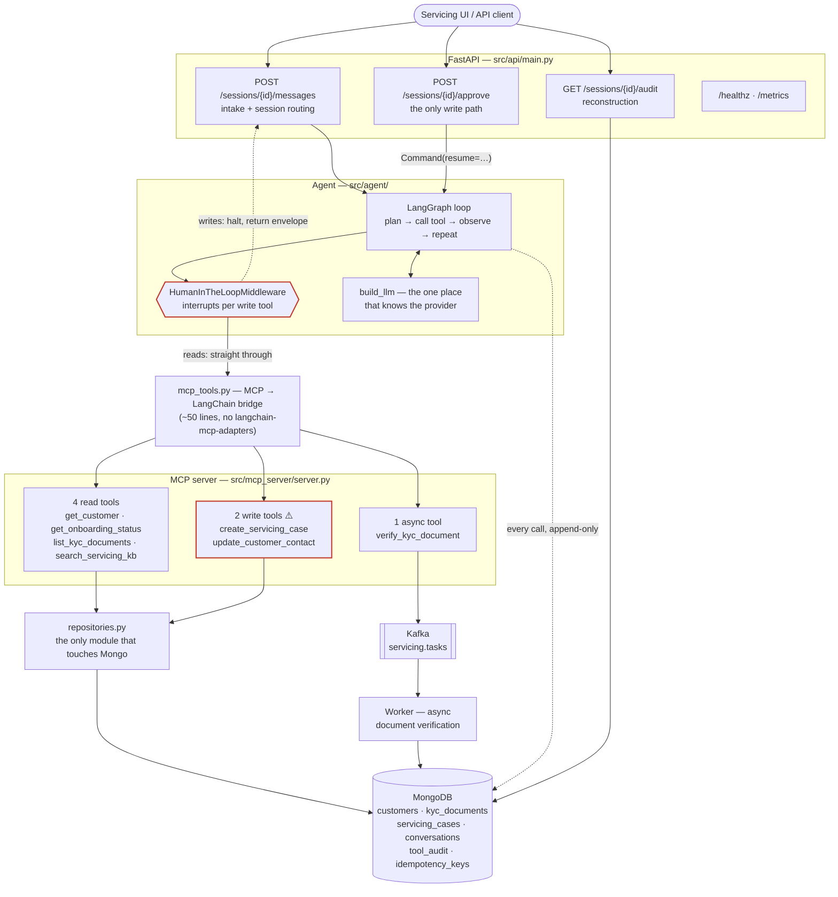
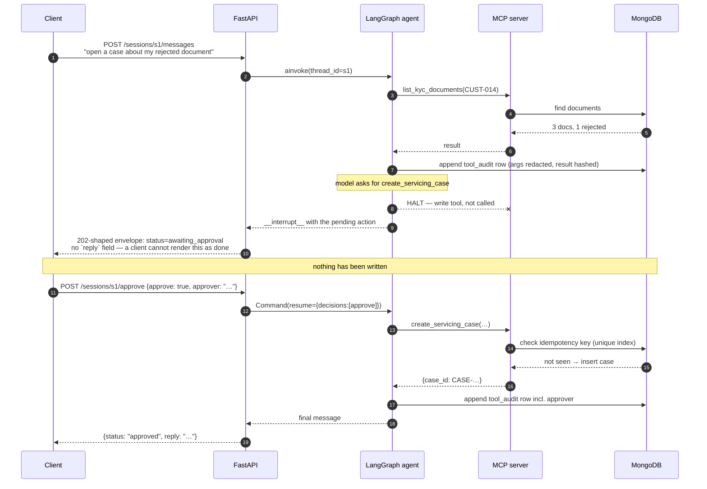
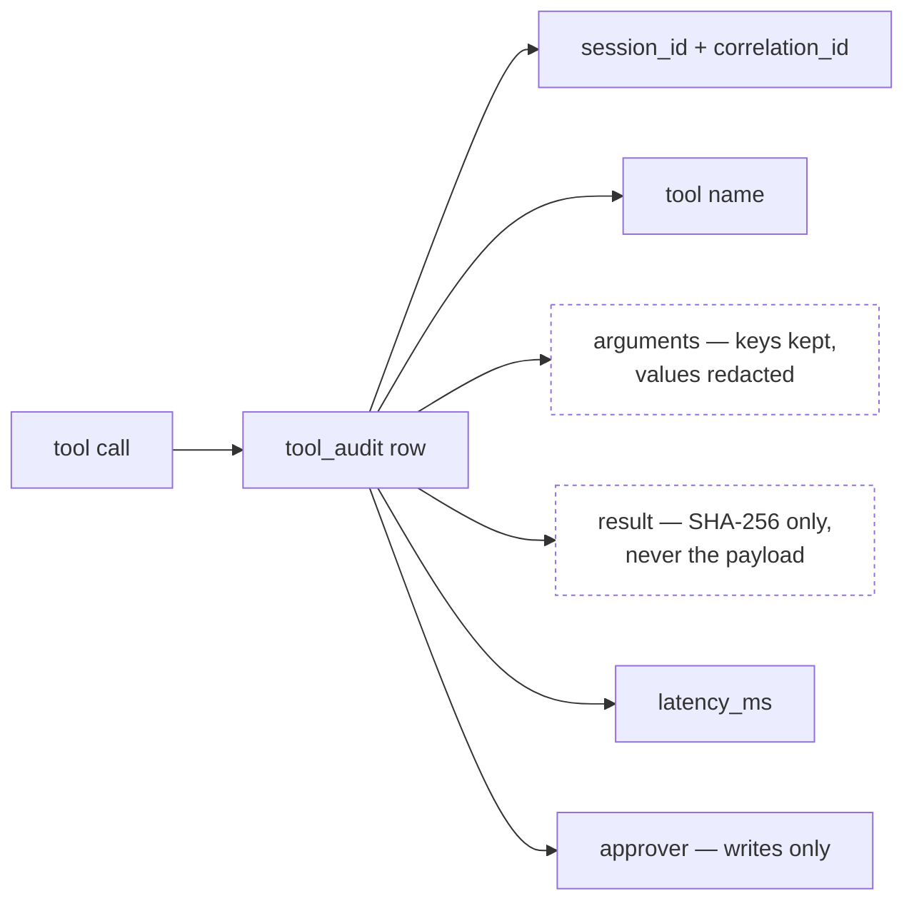

# Architecture

Three diagrams and the reasoning behind them. The short version: **the agent has no direct
database access.** Every capability it has is a typed MCP tool with an explicit contract, which is
what makes the audit trail complete, the permission model enforceable, and the agent framework
replaceable.

---

## 1. Components

**Read the diagram for what is *missing*.** There is no arrow from the agent to MongoDB. There is
no money-movement tool. An agent that can move money is a different risk conversation; the scope
here is servicing, and the tool surface enforces that rather than the prompt asking nicely.

The dotted line from the gate back to intake is the whole write story: a write does not become a
slower write, it becomes an *envelope* the caller has to act on.

---

## 2. The approval gate, as a sequence

The security-critical path. Note that the write tool is not called until after the human decides —
this is a halt, not a rollback.

Four properties make this a gate rather than a suggestion:

| Property | Why it holds |
|---|---|
| The pause is **structural** | `HumanInTheLoopMiddleware` interrupts the graph per tool. It does not depend on the model choosing to comply. Note *per tool* — all tools share one graph node, so a graph-level `interrupt_before` would have gated reads too. |
| Approval is the **only** write path | No endpoint performs a write directly. Approving with nothing pending is a **409**, not a silent no-op, so a stray call cannot be read as success. |
| The envelope carries **no `reply`** | A client physically cannot render a queued write as a completed one. |
| Writes are **idempotent** | Keyed on `(correlation_id, tool, arguments)` and enforced by a unique index — the database settles the race, not the application. A retry within the turn collapses; the same request next week legitimately opens a second case. |

---

## 3. What one turn writes to the audit trail

Three rules keep this an audit log rather than a second copy of the customer database:

- **Append-only.** `insert_one` and nothing else. There is no update or delete path.
- **Results are hashed, not stored.** The digest proves *what* the agent saw without persisting it.
- **Argument values are redacted.** The subtle case: `update_customer_contact(field="email",
  value=…)` carries the new address *in its arguments*, so hashing the result while logging raw
  args would leak precisely the field the write was about. There is a test asserting an approved
  email change lands in the database while the address appears nowhere in the trail.

An audit write failing never breaks a customer's turn — it is logged and swallowed. That is a
deliberate trade for a servicing assistant; a system that moved money would fail closed instead.

---

## 4. Why MCP, and not just functions bound to the agent

Binding Python functions straight into the agent is fewer moving parts, and for a single-framework
prototype it would be the right call. The MCP indirection buys three things that matter here:

1. **One audit point.** Every capability crosses the same boundary, so "log every tool call" is one
   place rather than a decorator someone forgets on the eighth tool.
2. **A contract the agent cannot bypass.** Tools are typed and discovered, not imported. The agent
   has no reference to a repository, so there is no path from a clever prompt to raw Mongo.
3. **The framework becomes swappable.** The Phase 11 Google ADK port binds the same MCP server and
   needs no change below the agent layer — the same eval suite runs against both runtimes.

The cost is real and worth stating: an extra process boundary, a serialization hop per call, and —
because `langchain-mcp-adapters` does not work against MCP SDK 2.x — about fifty lines of bridge
code this project owns. That tradeoff (own the glue vs. pin to a superseded SDK) is written up in
the README.

---

## Related

- [`PLAN.md`](./PLAN.md) — phase-by-phase build plan with acceptance tests
- [`../README.md`](../README.md) — quick start, tool surface, SDK notes
- [`../scripts/demo.py`](../scripts/demo.py) — the diagrams above, executed end to end
